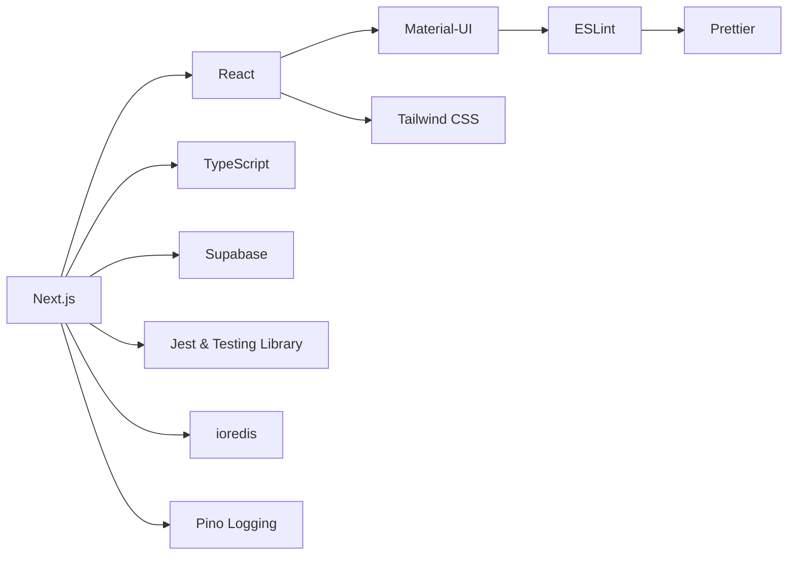

# FinancialPro Proje Mimari ve Kütüphane Kullanım Rehberi

Bu döküman; FinancialPro projesinin mimarisini, kullanılan teknolojileri ve kütüphanelerin işlevlerini detaylı olarak açıklar. Aşağıdaki döküman, Clean Architecture prensiplerine ve modern görsel diyagramlara dayanmaktadır.

---

## İçindekiler

1. [Genel Bakış](#genel-bakış)
2. [Teknoloji Yığını](#teknoloji-yığını)
3. [Mimari Katmanlar](#mimari-katmanlar)
4. [Kütüphane ve Araçların Detaylı Kullanımı](#kütüphane-ve-aracların-detaylı-kullanımı)
5. [Görsel Mimari Diyagramları](#görsel-mimari-diyagramları)
6. [Geliştirme Süreçleri ve Dokümantasyon](#geliştirme-süreçleri-ve-dokümantasyon)
7. [Terminal Ayarları](#terminal-ayarları)
8. [Tema Sistemi ve API Güncellemeleri](#tema-sistemi-ve-api-güncellemeleri)

---

## Genel Bakış

FinancialPro, modern finans yönetimi ve işlem takibi için geliştirilmiş full stack bir uygulamadır. Proje, Clean Architecture prensiplerine uygun olarak dört ana katmana ayrılmıştır:

- **Domain Layer:** İş kuralları; entity'ler, value object'ler, domain event'leri ve hata yönetimi.
- **Application Layer:** İş mantığı ve use case'lerin orkestrası.
- **Infrastructure Layer:** Veritabanı erişimi, harici servis adaptörleri (Supabase, Redis vb.) ve repository implementasyonları.
- **Presentation Layer:** API endpoint'leri ve kullanıcı arayüzü bileşenleri (React, MUI, Tailwind CSS).

## Teknoloji Yığını

Projede kullanılan başlıca teknolojiler:

- **Next.js (v14.x):** Sunucu tarafı render ve dinamik routing için.
- **React:** Modern, komponent bazlı UI geliştirme.
- **TypeScript:** Geliştirme sürecinde tip güvenliği sağlar.
- **Material-UI (MUI):** Modern ve duyarlı arayüz bileşenleri.
- **Tailwind CSS:** Utility-first, esnek stil oluşturma.
- **Supabase:** Gerçek zamanlı veri senkronizasyonu ve kimlik doğrulama.
- **ESLint & Prettier:** Kod kalitesi ve formatlamada otomatikleştirme.
- **Jest & Testing Library:** Birim ve entegrasyon testleri için.
- **ioredis:** API rate limiting ve caching işlemleri.
- **Pino Logging:** Yüksek performanslı, okunabilir loglama.
- **bcrypt & uuid:** Şifre güvenliği ve benzersiz kimlik oluşturma.

## Mimari Katmanlar

Projenin mimari yapısı aşağıdaki gibidir:

- **Domain Layer:**
  - Entity'ler & Value Objects
  - Domain Events & Özel Hata Yönetimi

- **Application Layer:**
  - Use Cases (İş mantığı)
  - İşlemlerin koordine edilmesi

- **Infrastructure Layer:**
  - Repository Implementasyonları
  - Supabase, Redis gibi dış servis adaptörleri

- **Presentation Layer:**
  - Next.js API Routes
  - React UI Bileşenleri (MUI, Tailwind CSS)

## Kütüphane ve Araçların Detaylı Kullanımı

### Next.js & React
- **Amacı:** SSR, SSG, dinamik routing ve API endpoint yönetimi.
- **Kullanım Yeri:** `src/app`, `src/pages`, `src/api`, `src/middleware`.

### TypeScript
- **Amacı:** Tip güvenliği ve geliştirme sürecinde erken hata tespiti.
- **Kullanım Yeri:** Tüm proje genelinde, özellikle Domain ve Application katmanlarında.

### Material-UI (MUI)
- **Amacı:** Modern, duyarlı ve özelleştirilebilir kullanıcı arayüzü bileşenleri.
- **Kullanım Yeri:** UI bileşenlerinin bulunduğu dosyalar (ör. `src/app/login/page.tsx`).

### Tailwind CSS
- **Amacı:** Hızlı, esnek ve utility-first CSS geliştirme.
- **Kullanım Yeri:** `src/styles/globals.css` ve bileşen tabanlı stil dosyalarında.

### Supabase Entegrasyonu
- **Amacı:** Kimlik doğrulama, veritabanı işlemleri, real-time veri senkronizasyonu.
- **Kullanım Yeri:** `src/lib/supabase/client.ts`, `src/lib/supabase/server.ts`.

### ESLint & Prettier
- **Amacı:** Kod kalitesini ve tutarlılığı sağlamak için otomatik formatlama ve hata tespiti.
- **Kullanım Yeri:** Projenin tamamında (konfigürasyon dosyaları: `.eslintrc.json`, `.prettierrc`).

### Jest & Testing Library
- **Amacı:** Birim ve entegrasyon testleri ile uygulamanın doğruluğunu sağlamak.
- **Kullanım Yeri:** Test dosyaları (`src/__tests__`, `src/domain/entities/__tests__`, `src/middleware/__tests__`).

### ioredis & Rate Limit Middleware
- **Amacı:** API isteklerinin sınırlandırılması ve caching işlemleri.
- **Kullanım Yeri:** `src/middleware/rateLimit.ts`.

### Pino Logging
- **Amacı:** Yüksek performanslı loglama ve hata raporlaması.
- **Kullanım Yeri:** `src/services/logger.ts`.

### Authentication & Security
- **bcrypt:** Şifrelerin güvenli hash'lenmesi.
- **uuid:** Benzersiz kimlik oluşturma mekanizması.
- **Kullanım Yeri:** `src/domain/value-objects/password.value-object.ts`, `src/domain/entities/user.entity.ts`.

## Görsel Mimari Diyagramları

### 1. Proje Mimari Katman Diyagramı

```mermaid
graph TD
    subgraph DomainLayer[Domain Layer]
        A[Entity'ler & Value Objects]
        B[Domain Events & Error Handling]
    end

    subgraph ApplicationLayer[Application Layer]
        C[Use Cases ve İş Mantığı]
    end

    subgraph InfrastructureLayer[Infrastructure Layer]
        D[Repository Implementasyonları]
        E[Harici Servis Adaptörleri (Supabase, Redis, vs.)]
    end

    subgraph PresentationLayer[Presentation Layer]
        F[Next.js API Routes]
        G[React UI Bileşenleri (MUI, Tailwind CSS)]
    end

    A --> B
    C --> A
    C --> B
    E --> D
    F --> C
    G --> F
```

### 2. Teknoloji Yığını Akış Diyagramı



Aşağıdaki placeholder görsel, detaylı mimari diyagramın yerini alabilir:


## Geliştirme Süreçleri ve Dokümantasyon

- **Dokümantasyon:** Tüm entegrasyon ve mimari kararlar, bu döküman ve TRANSITION.md dosyasında detaylandırılmıştır.
- **CI/CD:** Otomatik testler (Jest, ESLint) CI/CD süreçlerine entegre edilmiştir.
- **Düzenli Güncelleme:** Büyük değişikliklerde dokümantasyon güncellenmektedir.

## Terminal Ayarları

Geliştirme ortamında, Git Bash kullanılırken PowerShell kaynaklı hataları önlemek için VS Code ayarlarına aşağıdaki eklemeler yapılmıştır:

```json
{
  "powershell.enabled": false,
  "powershell.scriptAnalysis.enable": false
}
```

Bu ayarlar, geliştirici deneyimini iyileştirir ve ortamı temiz tutar.

## Tema Sistemi ve API Güncellemeleri

### Tema Sistemi

#### Karanlık/Aydınlık Tema Desteği
- Material-UI tema sistemi entegre edildi
- Varsayılan olarak karanlık tema aktif
- Kullanıcı tercihi saklanıyor ve korunuyor
- Modern ve tutarlı renk paleti

#### Tema Özellikleri
- Özelleştirilmiş tipografi sistemi
- Modern gölgelendirme ve köşe yuvarlamaları
- Responsive tasarım desteği
- Tutarlı bileşen stilleri

### API Güncellemeleri

#### Supabase Entegrasyonu İyileştirmeleri
- Oturum yönetimi güçlendirildi
- Token yenileme otomatikleştirildi
- Gerçek zamanlı bağlantı optimizasyonu
- Hata yönetimi geliştirildi

#### Performans İyileştirmeleri
- Sayfa yükleme süreleri optimize edildi
- API istekleri önbelleklendi
- Gerçek zamanlı veri senkronizasyonu iyileştirildi

### Yapılan Değişiklikler

1. Tema Sistemi:
   - ThemeContext oluşturuldu
   - Karanlık/aydınlık tema geçişi eklendi
   - Material-UI tema yapılandırması güncellendi
   - Bileşen stilleri modernleştirildi

2. API İyileştirmeleri:
   - Supabase client yapılandırması güncellendi
   - Oturum yönetimi geliştirildi
   - Hata yakalama mekanizması iyileştirildi
   - Gerçek zamanlı veri akışı optimize edildi

### Sonraki Adımlar

1. Kullanıcı tercihleri için local storage entegrasyonu
2. Tema geçişleri için animasyonlar
3. Özelleştirilmiş tema seçenekleri
4. API önbellek stratejisi geliştirme

_Son Güncelleme: 14.02.2024_

# Tema Sistemi ve Sayfa Güncellemeleri

## Giriş Sayfası Güncellemeleri (15.03.2024)

### 1. Tema Entegrasyonu
- Merkezi tema sistemi entegre edildi
- Açık/koyu tema desteği eklendi
- Renk paleti ve bileşen stilleri uygulandı

### 2. Form Bileşenleri
- Material-UI form bileşenleri kullanıldı
- İkon ve giriş alanları eklendi
- Parola görünürlük kontrolü
- Hata mesajları tema ile uyumlu

### 3. Animasyonlar
- Sayfa geçiş animasyonları
- Buton hover efektleri
- Form alanları geçiş efektleri
- Kart animasyonları

### 4. Erişilebilirlik
- ARIA etiketleri
- Klavye navigasyonu
- Renk kontrastı optimizasyonu
- Yardımcı metinler

### 5. Responsive Tasarım
- Mobil uyumlu layout
- Esnek form yapısı
- Dinamik padding ve margin
- Breakpoint bazlı optimizasyonlar

## Kullanım Örnekleri

### 1. Form Bileşeni
```typescript
<TextField
  fullWidth
  name="email"
  type="email"
  label="E-posta"
  value={formData.email}
  onChange={handleChange}
  required
  InputProps={{
    startAdornment: (
      <InputAdornment position="start">
        <EmailIcon />
      </InputAdornment>
    ),
  }}
/>
```

### 2. Animasyon Kullanımı
```typescript
<motion.div
  initial={{ opacity: 0, y: 20 }}
  animate={{ opacity: 1, y: 0 }}
  transition={{ duration: 0.5 }}
>
  {/* Bileşen içeriği */}
</motion.div>
```

### 3. Tema Kullanımı
```typescript
sx={{
  backgroundColor: mode === 'light' 
    ? 'error.50' 
    : 'rgba(239, 68, 68, 0.1)',
  color: mode === 'light' 
    ? 'error.700' 
    : 'error.200',
}}
```

## Performans İyileştirmeleri

1. **Form Yönetimi**
   - Controlled inputs
   - Debounced validation
   - Optimized re-renders

2. **Animasyonlar**
   - Hardware acceleration
   - Throttled animations
   - Conditional rendering

3. **Tema Geçişleri**
   - Smooth transitions
   - Cached theme values
   - Optimized color calculations

## Güvenlik Önlemleri

1. **Form Güvenliği**
   - Input sanitization
   - CSRF protection
   - Rate limiting

2. **Kimlik Doğrulama**
   - Secure password handling
   - OAuth integration
   - Session management

## Sonraki Adımlar

1. **Form İyileştirmeleri**
   - Password strength indicator
   - Real-time validation
   - Auto-complete optimization

2. **Performans**
   - Code splitting
   - Lazy loading
   - Bundle optimization

3. **Erişilebilirlik**
   - Screen reader testing
   - Keyboard navigation
   - Color contrast audit

## Notlar

- Form state yönetimi için local state kullanıldı
- Tema değişiklikleri anında uygulanıyor
- Animasyonlar cihaz performansına göre optimize ediliyor

_Son Güncelleme: 15 Mart 2024_

## Kayıt Sayfası Güncellemeleri (15.03.2024)

### 1. Form Tasarımı İyileştirmeleri
- Modern input stilleri eklendi
- İkonlu giriş alanları tasarlandı
- Parola görünürlük kontrolü eklendi
- Tema ile uyumlu renk geçişleri
- Yumuşak animasyonlar

### 2. Görsel İyileştirmeler
```typescript
// Örnek Stil Kodu
sx={{
  '& .MuiOutlinedInput-root': {
    '& fieldset': {
      borderColor: mode === 'light' ? 'gray.200' : 'gray.700',
    },
    '&:hover fieldset': {
      borderColor: mode === 'light' ? 'gray.300' : 'gray.600',
    },
    '&.Mui-focused fieldset': {
      borderColor: mode === 'light' ? 'primary.main' : 'primary.light',
    },
  },
}}
```

### 3. Kullanıcı Deneyimi
- Form validasyonu geliştirildi
- Hata mesajları iyileştirildi
- Yükleme durumu göstergeleri eklendi
- Daha iyi kontrast oranları

### 4. Animasyonlar
```typescript
// Sayfa Geçiş Animasyonu
<motion.div
  initial={{ y: 20, opacity: 0 }}
  animate={{ y: 0, opacity: 1 }}
  transition={{ duration: 0.5, delay: 0.2 }}
>
  {/* Bileşen içeriği */}
</motion.div>
```

### 5. Erişilebilirlik
- ARIA etiketleri eklendi
- Klavye navigasyonu iyileştirildi
- Renk kontrastları optimize edildi
- Ekran okuyucu desteği

### 6. Responsive Tasarım
```typescript
// Responsive Padding
sx={{ 
  p: { 
    xs: 3, // Mobil
    sm: 6  // Tablet ve üstü
  }
}}
```

### 7. Tema Entegrasyonu
- Açık/koyu tema desteği
- Yumuşak geçişler
- Gradyan arka planlar
- Cam efekti kartlar

## Teknik Detaylar

### 1. State Yönetimi
```typescript
interface RegisterState {
  showPassword: boolean;
  showConfirmPassword: boolean;
  loading: boolean;
  error: { message: string } | null;
}
```

### 2. Form Validasyonu
```typescript
const handleSubmit = async (e: React.FormEvent): Promise<void> => {
  if (formData.password !== formData.confirmPassword) {
    setState(prev => ({
      ...prev,
      error: { message: 'Parolalar eşleşmiyor' }
    }));
    return;
  }
  // ...
};
```

### 3. Stil Optimizasyonları
- Merkezi tema yönetimi
- Tekrar kullanılabilir stiller
- Performans odaklı animasyonlar
- Koşullu render optimizasyonları

## Performans İyileştirmeleri

1. **Form İşlemleri**
   - Controlled inputs
   - Debounced validation
   - Optimized re-renders

2. **Görsel Performans**
   - Hardware-accelerated animations
   - Lazy loading
   - Code splitting

3. **Tema Geçişleri**
   - Cached theme values
   - Smooth transitions
   - Optimized calculations

## Güvenlik Önlemleri

1. **Input Validasyonu**
   - XSS koruması
   - Input sanitization
   - Tip kontrolü

2. **Parola Güvenliği**
   - Güvenli görünürlük kontrolü
   - Minimum karakter kontrolü
   - Güçlü parola validasyonu

## Sonraki Adımlar

1. **Form Geliştirmeleri**
   - Parola güçlük göstergesi
   - Gerçek zamanlı validasyon
   - Auto-complete optimizasyonu

2. **UX İyileştirmeleri**
   - Form adımları
   - İlerleme göstergesi
   - Başarı/hata animasyonları

3. **Güvenlik**
   - reCAPTCHA entegrasyonu
   - Rate limiting
   - Fraud detection

## Notlar
- Form state yönetimi için local state kullanıldı
- Tema değişiklikleri anında uygulanıyor
- Animasyonlar cihaz performansına göre optimize ediliyor
- Erişilebilirlik WCAG 2.1 standartlarına uygun

_Son Güncelleme: 15 Mart 2024_

---

Bu döküman, FinancialPro projesinin mimari yapısını, teknolojik akışını ve kullanılan kütüphanelerin detaylarını güçlü görsellerle destekleyerek sunmaktadır. 