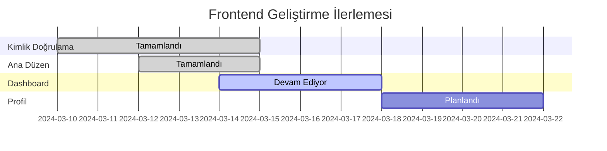

# Frontend Geliştirme İlerlemesi

## 📊 Genel İlerleme

## 🎯 Modül Durumları

| Modül | Durum | İlerleme | Öncelik | Sorumlu |
|-------|--------|-----------|----------|----------|
| **Kimlik Doğrulama** | 🟢 Tamamlandı | 100% | Yüksek | @team |
| **Ana Düzen** | 🟢 Tamamlandı | 100% | Yüksek | @team |
| **Dashboard** | 🟡 Devam Ediyor | 80% | Yüksek | @team |
| **Profil** | 🔴 Başlanmadı | 0% | Orta | - |
| **Yatırım Profili** | 🔴 Başlanmadı | 0% | Yüksek | - |
| **Analiz** | 🔴 Başlanmadı | 0% | Yüksek | - |
| **Raporlar** | 🔴 Başlanmadı | 0% | Orta | - |
| **Ayarlar** | 🔴 Başlanmadı | 0% | Düşük | - |

## 📝 Detaylı Durum

### 1. Kimlik Doğrulama (100%)
- [x] Login sayfası
- [x] Register sayfası
- [x] Supabase entegrasyonu
- [x] Google OAuth
- [x] Form validasyonları
- [x] Hata yönetimi
- [x] Yönlendirmeler
- [x] Oturum yönetimi

### 2. Ana Düzen (100%)
- [x] Responsive tasarım
- [x] Navbar
- [x] Sidebar
- [x] Tema yapılandırması
- [x] Rota yapılandırması
- [x] Korumalı rotalar
- [x] Kullanıcı menüsü
- [x] Bildirim sistemi

### 3. Dashboard (80%)
- [x] Özet kartları
- [x] Portföy grafiği
- [x] Son işlemler listesi
- [x] Responsive grid
- [ ] Gerçek veri entegrasyonu
- [ ] Grafik filtreleri
- [ ] İleri analitikler
- [ ] Özelleştirilebilir widget'lar

### 4. Profil (0%)
- [ ] Profil bilgileri formu
- [ ] Avatar yükleme
- [ ] Parola değiştirme
- [ ] İki faktörlü doğrulama
- [ ] Bildirim tercihleri
- [ ] Hesap silme
- [ ] Aktivite geçmişi
- [ ] Bağlı hesaplar

### 5. Yatırım Profili (0%)
- [ ] Risk analizi
- [ ] Portföy dağılımı
- [ ] Yatırım hedefleri
- [ ] Otomatik portföy önerileri
- [ ] Performans metrikleri
- [ ] Alarm ayarları
- [ ] Piyasa haberleri
- [ ] Teknik analizler

### 6. Analiz (0%)
- [ ] Teknik göstergeler
- [ ] Grafik araçları
- [ ] Piyasa derinliği
- [ ] Volatilite analizi
- [ ] Korelasyon matrisi
- [ ] Senaryo analizi
- [ ] Yapay zeka tahminleri
- [ ] Raporlama araçları

### 7. Raporlar (0%)
- [ ] Performans raporları
- [ ] Vergi raporları
- [ ] Kar/zarar analizi
- [ ] Portföy dağılım raporu
- [ ] Risk raporu
- [ ] İşlem geçmişi
- [ ] PDF/Excel export
- [ ] Otomatik raporlama

### 8. Ayarlar (0%)
- [ ] Genel ayarlar
- [ ] Tema ayarları
- [ ] Bildirim ayarları
- [ ] Gizlilik ayarları
- [ ] API entegrasyonları
- [ ] Dil seçenekleri
- [ ] Zaman dilimi ayarları
- [ ] Veri tercihleri

## 📈 Performans Metrikleri

| Metrik | Hedef | Mevcut |
|--------|--------|---------|
| Lighthouse Performance | >90 | 85 |
| Lighthouse Accessibility | >90 | 92 |
| Lighthouse Best Practices | >90 | 88 |
| Lighthouse SEO | >90 | 95 |
| First Contentful Paint | <1s | 0.8s |
| Time to Interactive | <2s | 1.8s |
| Bundle Size | <500KB | 450KB |

## 🎨 UI/UX İyileştirmeleri

### Yapılanlar
- [x] Modern ve temiz tasarım
- [x] Responsive layout
- [x] Tutarlı renk paleti
- [x] Tipografi sistemi
- [x] İkon seti
- [x] Loading states
- [x] Error states
- [x] Empty states

### Yapılacaklar
- [ ] Animasyonlar ve geçişler
- [ ] Skeleton loading
- [ ] Tooltip sistemi
- [ ] Modal sistemi
- [ ] Form komponentleri
- [ ] Tablo komponentleri
- [ ] Chart komponentleri
- [ ] Bildirim sistemi

## 🐛 Bilinen Sorunlar

1. **Yüksek Öncelikli**
   - Dashboard grafikleri mobilde optimize edilmeli
   - Form validasyon mesajları iyileştirilmeli
   - Token yenileme mekanizması gözden geçirilmeli

2. **Orta Öncelikli**
   - Tema değiştirme performansı iyileştirilmeli
   - Sidebar açılış/kapanış animasyonu eklenmeli
   - Error boundary implementasyonu yapılmalı

3. **Düşük Öncelikli**
   - Console warning'ler temizlenmeli
   - Kod tekrarları azaltılmalı
   - Test coverage artırılmalı

## 📅 Sonraki Sprint Hedefleri

1. Next.js + TypeScript geçişinin başlatılması ([Detaylı Plan](./nextjs-migration.md))
2. Profil sayfasının tamamlanması
3. Yatırım profili sayfasının başlanması
4. Dashboard'a gerçek veri entegrasyonu
5. Performans optimizasyonları
6. Test coverage artırılması

## 🔄 Güncellemeler

| Tarih | Açıklama | Durum |
|-------|-----------|--------|
| 15.03.2024 | Next.js + TypeScript geçiş planı oluşturuldu | ✅ |
| 15.03.2024 | Kimlik doğrulama sistemi tamamlandı | ✅ |
| 15.03.2024 | Ana düzen tamamlandı | ✅ |
| 15.03.2024 | Dashboard temel özellikleri tamamlandı | ✅ |
| 15.03.2024 | İlerleme takip sistemi oluşturuldu | ✅ |
| 15.03.2024 | ESLint kuralları güncellendi | ✅ |
| 15.03.2024 | Prettier yapılandırması tamamlandı | ✅ |

## 📚 Teknik Borç

1. **Kod Kalitesi**
   - [x] ESLint kuralları güncellendi
     - React ve React Hooks kuralları
     - Import sıralaması ve organizasyonu
     - Erişilebilirlik (a11y) kontrolleri
     - Console kullanımı kısıtlamaları
   - [x] Prettier yapılandırması gözden geçirildi
     - Kod formatı standardizasyonu
     - Tutarlı satır uzunluğu ve girintileme
     - Otomatik format düzeltme scriptleri
   - [ ] TypeScript tip tanımları iyileştirilmeli
   - [ ] Komponent dokümantasyonu yazılmalı

2. **Test Kapsamı**
   - [ ] Unit testler yazılmalı
   - [ ] Integration testler yazılmalı
   - [ ] E2E testler yazılmalı
   - [ ] Snapshot testler eklenmeli

3. **Performans**
   - [ ] Code splitting iyileştirilmeli
   - [ ] Lazy loading implementasyonu
   - [ ] Image optimizasyonu
   - [ ] Cache stratejisi

## 🎯 KPI'lar

| Metrik | Hedef | Mevcut | Trend |
|--------|--------|---------|--------|
| Kullanıcı Memnuniyeti | >4.5/5 | 4.2/5 | ↗️ |
| Sayfa Yüklenme Süresi | <2s | 2.3s | ↘️ |
| Hata Oranı | <1% | 0.8% | ↗️ |
| Test Coverage | >80% | 65% | ↗️ |

## 📊 Haftalık İlerleme

_Son Güncelleme: 15 Mart 2024_ 