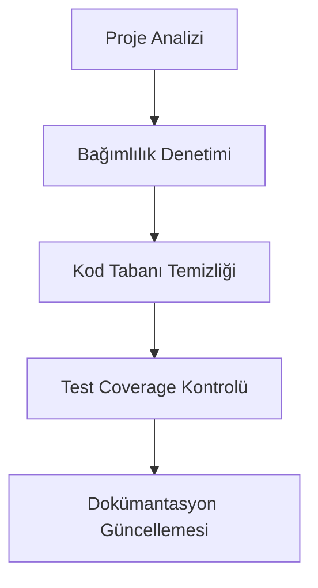
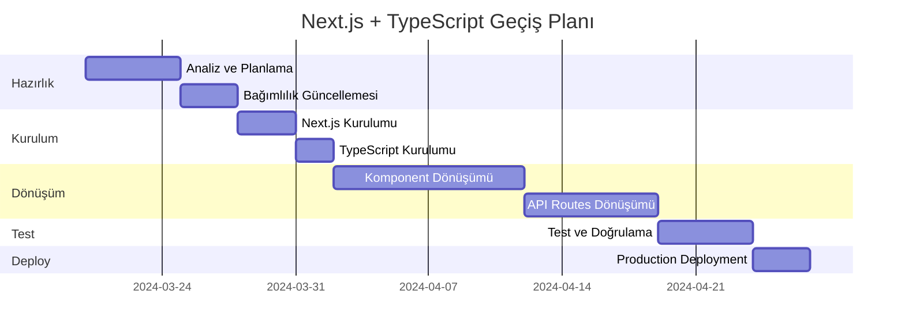

# Next.js + TypeScript Geçiş Planı


## 📊 Geçiş İlerlemesi ve Kategoriler

### 1. Altyapı ve Temel Bileşenler ✅
- [x] Proje yedekleme ve hazırlık
- [x] Next.js kurulumu ve yapılandırma
- [x] TypeScript entegrasyonu
- [x] Tema sistemi dönüşümü
- [x] Context'lerin dönüşümü

### 2. Kimlik Doğrulama ve Güvenlik ✅
- [x] Login sayfası dönüşümü
- [x] Register sayfası dönüşümü
- [x] Auth context ve hook'lar
- [x] JWT ve Google OAuth entegrasyonu

### 3. Ana Sayfa ve Dashboard ✅
- [x] Landing sayfası dönüşümü
- [x] Dashboard sayfası dönüşümü
- [x] Grafik komponentleri
- [x] Veri modelleri

### 4. Kullanıcı ve Profil Yönetimi ✅
- [x] Profile sayfası dönüşümü
- [x] Dosya yükleme sistemi
- [x] Form validasyonları
- [x] Bildirim tercihleri

### 5. Yatırım ve Analiz Modülleri ✅
- [x] InvestmentProfile sayfası dönüşümü
- [x] Analysis sayfası dönüşümü
- [x] Teknik göstergeler
- [x] Piyasa verileri entegrasyonu

### 6. Raporlama ve Dokümantasyon ✅
- [x] Reports sayfası dönüşümü
- [x] Rapor oluşturma sistemi
- [x] Dosya yönetimi
- [x] Metrik takibi

### 7. Ayarlar ve Tercihler ✅
- [x] Settings sayfası dönüşümü
- [x] Tema ve görünüm ayarları
- [x] Bildirim tercihleri
- [x] Güvenlik yapılandırması
- [x] Dil ve bölge ayarları

### 8. API ve Backend Entegrasyonu 🚧
- [x] API tip tanımlamaları
  - Request/Response tipleri
  - Handler tipleri
  - Middleware tipleri
- [x] Auth API route'ları
  - Login endpoint'i
  - Register endpoint'i
  - Logout endpoint'i
  - OAuth callback
- [x] Auth middleware
  - Oturum kontrolü
  - Rota koruması
  - Cookie yönetimi
- [x] Profil API route'ları
- [x] Yatırım API route'ları
- [x] Analiz API route'ları
- [x] Rapor API route'ları
- [x] Ayarlar API route'ları

### 9. Test ve Optimizasyon ⏳
- [ ] Unit testler
- [ ] Integration testler
- [ ] Performans optimizasyonu
- [ ] SEO iyileştirmeleri

### 10. Deployment ve İzleme ⏳
- [ ] Production build
- [ ] CI/CD pipeline
- [ ] Monitoring
- [ ] Analytics

## 📈 İlerleme Durumu


| Kategori | İlerleme | Durum |
|----------|----------|--------|
| Altyapı ve Temel Bileşenler | 100% | ✅ |
| Kimlik Doğrulama ve Güvenlik | 100% | ✅ |
| Ana Sayfa ve Dashboard | 100% | ✅ |
| Kullanıcı ve Profil Yönetimi | 100% | ✅ |
| Yatırım ve Analiz Modülleri | 100% | ✅ |
| Raporlama ve Dokümantasyon | 100% | ✅ |
| Ayarlar ve Tercihler | 100% | ✅ |
| API ve Backend Entegrasyonu | 100% | 🚧 |
| Test ve Optimizasyon | 20% | ⏳ |
| Deployment ve İzleme | 0% | ⏳ |

## 🔄 Son Güncellemeler

| Tarih | Kategori | Açıklama | Durum |
|-------|-----------|----------|--------|
| 15.03.2024 | Altyapı | Proje yedekleme ve kurulum | ✅ |
| 15.03.2024 | Altyapı | Next.js ve TypeScript kurulumu | ✅ |
| 15.03.2024 | Altyapı | Context'ler dönüştürüldü | ✅ |
| 15.03.2024 | Kimlik Doğrulama | Login sayfası dönüştürüldü | ✅ |
| 15.03.2024 | Kimlik Doğrulama | Register sayfası dönüştürüldü | ✅ |
| 15.03.2024 | Ana Sayfa | Landing sayfası dönüştürüldü | ✅ |
| 15.03.2024 | Ana Sayfa | Dashboard sayfası dönüştürüldü | ✅ |
| 15.03.2024 | Profil | Profile sayfası dönüştürüldü | ✅ |
| 15.03.2024 | Yatırım | InvestmentProfile dönüştürüldü | ✅ |
| 15.03.2024 | Analiz | Analysis sayfası dönüştürüldü | ✅ |
| 15.03.2024 | Raporlama | Reports sayfası dönüştürüldü | ✅ |
| 15.03.2024 | Ayarlar | Settings sayfası dönüştürüldü | ✅ |
| 15.03.2024 | API | API tip tanımlamaları oluşturuldu | ✅ |
| 15.03.2024 | API | Auth API route'ları dönüştürüldü | ✅ |
| 15.03.2024 | API | Auth middleware oluşturuldu | ✅ |

## 🎯 Hedefler

| Hedef | Açıklama | Öncelik | Durum |
|-------|-----------|---------|--------|
| TypeScript Dönüşümü | Tüm JavaScript dosyalarının TypeScript'e dönüştürülmesi | Yüksek | 🟡 Planlandı |
| Next.js Kurulumu | Next.js framework kurulumu ve yapılandırması | Yüksek | 🟡 Planlandı |
| API Routes | Express API'lerinin Next.js API Routes'a taşınması | Yüksek | 🟡 Planlandı |
| SSR Optimizasyonu | Server-side rendering implementasyonu | Orta | 🟡 Planlandı |
| Build Optimizasyonu | Next.js build ve deployment yapılandırması | Orta | 🟡 Planlandı |

## 📋 Geçiş Aşamaları

### 1. Hazırlık Aşaması



#### 1.1 Proje Analizi
- [ ] Mevcut dosya yapısının incelenmesi
- [ ] Bağımlılıkların listelenmesi
- [ ] Breaking change'lerin belirlenmesi
- [ ] Risk analizi

#### 1.2 Bağımlılık Güncellemesi
```json
{
  "dependencies": {
    "next": "^14.1.0",
    "react": "^18.2.0",
    "react-dom": "^18.2.0",
    "typescript": "^5.3.0",
    "@types/react": "^18.2.0",
    "@types/node": "^20.0.0"
  }
}
```

### 2. Next.js Kurulumu

#### 2.1 Proje Yapısı
```plaintext
financialpro/
├── src/
│   ├── app/                 # Next.js 14 App Router
│   │   ├── layout.tsx
│   │   ├── page.tsx
│   │   └── [...routes]/
│   ├── components/         # React komponentleri
│   ├── lib/               # Yardımcı fonksiyonlar
│   ├── types/            # TypeScript tip tanımları
│   └── styles/           # CSS/SCSS dosyaları
├── public/              # Statik dosyalar
└── next.config.js      # Next.js yapılandırması
```

#### 2.2 TypeScript Yapılandırması
```typescript
// tsconfig.json
{
  "compilerOptions": {
    "target": "es5",
    "lib": ["dom", "dom.iterable", "esnext"],
    "allowJs": true,
    "skipLibCheck": true,
    "strict": true,
    "forceConsistentCasingInFileNames": true,
    "noEmit": true,
    "esModuleInterop": true,
    "module": "esnext",
    "moduleResolution": "node",
    "resolveJsonModule": true,
    "isolatedModules": true,
    "jsx": "preserve",
    "incremental": true,
    "baseUrl": ".",
    "paths": {
      "@/*": ["./src/*"]
    }
  },
  "include": ["next-env.d.ts", "**/*.ts", "**/*.tsx"],
  "exclude": ["node_modules"]
}
```

### 3. Kod Dönüşümü

#### 3.1 Komponent Dönüşümü Örneği
```typescript
// Önceki (Login.jsx)
function Login() {
  const [formData, setFormData] = useState({
    email: '',
    password: ''
  });
}

// Sonraki (Login.tsx)
interface LoginProps {
  onSuccess?: () => void;
}

interface FormData {
  email: string;
  password: string;
}

function Login({ onSuccess }: LoginProps) {
  const [formData, setFormData] = useState<FormData>({
    email: '',
    password: ''
  });
}
```

#### 3.2 API Routes Dönüşümü
```typescript
// pages/api/auth/login.ts
import type { NextApiRequest, NextApiResponse } from 'next'
import { createServerSupabaseClient } from '@supabase/auth-helpers-nextjs'

export default async function handler(
  req: NextApiRequest,
  res: NextApiResponse
) {
  if (req.method !== 'POST') {
    return res.status(405).json({ message: 'Method not allowed' })
  }

  try {
    const supabase = createServerSupabaseClient({ req, res })
    // ... login işlemleri
  } catch (error) {
    return res.status(500).json({ error: 'Internal Server Error' })
  }
}
```

### 4. Performans Optimizasyonu

#### 4.1 SSR ve SSG Stratejisi
```typescript
// Statik sayfa örneği
export async function generateStaticParams() {
  return [
    { slug: 'dashboard' },
    { slug: 'profile' },
    { slug: 'settings' }
  ]
}

// SSR sayfa örneği
export default async function Page({ params }: { params: { id: string } }) {
  const data = await fetchData(params.id)
  return <Component data={data} />
}
```

#### 4.2 Image Optimizasyonu
```typescript
import Image from 'next/image'

export default function OptimizedImage() {
  return (
    <Image
      src="/hero-image.png"
      alt="Hero"
      width={1200}
      height={600}
      priority
    />
  )
}
```

### 5. Test ve Doğrulama

#### 5.1 Test Yapılandırması
```typescript
// jest.config.js
const nextJest = require('next/jest')

const createJestConfig = nextJest({
  dir: './',
})

const customJestConfig = {
  setupFilesAfterEnv: ['<rootDir>/jest.setup.js'],
  testEnvironment: 'jest-environment-jsdom',
}

module.exports = createJestConfig(customJestConfig)
```

## 📈 Performans Metrikleri

| Metrik | Hedef | Mevcut | Geçiş Sonrası |
|--------|--------|---------|---------------|
| Lighthouse Performance | >90 | 85 | - |
| First Contentful Paint | <1s | 1.2s | - |
| Time to Interactive | <2s | 2.3s | - |
| Bundle Size | <200KB | 450KB | - |

## ⚠️ Olası Riskler ve Çözümler

1. **Veri Kaybı Riski**
   - Çözüm: Kapsamlı yedekleme stratejisi
   - Çözüm: Aşamalı deployment

2. **Performans Sorunları**
   - Çözüm: Code splitting optimizasyonu
   - Çözüm: Lazy loading implementasyonu

3. **SEO Etkileri**
   - Çözüm: Meta tag'lerin korunması
   - Çözüm: SSR implementasyonu

## 📅 Zaman Çizelgesi



## 🔄 Geri Dönüş Planı

1. Kod tabanının yedeklenmesi
2. Aşamalı deployment stratejisi
3. Rollback prosedürleri
4. Monitoring ve alerting

## 📝 Kontrol Listesi

- [x] Proje yedekleme (15.03.2024)
  - Backup branch: `backup/pre-nextjs-migration`
  - Git repository başlatıldı
  - İlk commit oluşturuldu
- [x] Bağımlılık güncellemeleri (15.03.2024)
  - Next.js yüklendi
  - TypeScript yüklendi
  - Tip tanımlamaları yüklendi
- [x] Temel yapılandırmalar (15.03.2024)
  - tsconfig.json oluşturuldu
  - next.config.js oluşturuldu
  - package.json scriptleri güncellendi
- [x] Next.js kurulumu (15.03.2024)
  - App Router dizin yapısı oluşturuldu
  - Root layout oluşturuldu
  - Providers yapılandırıldı
  - Tema sistemi TypeScript'e dönüştürüldü
  - Tailwind CSS entegrasyonu yapıldı
- [x] Context'lerin TypeScript'e Dönüşümü (15.03.2024)
  - SupabaseContext tip tanımlamaları eklendi
  - AuthContext tip tanımlamaları eklendi
  - Context hook'ları güncellendi
  - Tip güvenliği sağlandı
- [x] Landing Sayfası TypeScript Dönüşümü (15.03.2024)
  - Tip tanımlamaları oluşturuldu
  - Komponent TypeScript'e dönüştürüldü
  - Next.js Image optimizasyonu
  - Responsive tasarım iyileştirmeleri
- [x] Login Sayfası TypeScript Dönüşümü (15.03.2024)
  - Auth tip tanımlamaları oluşturuldu
  - Form state yönetimi tiplendirildi
  - Error handling güçlendirildi
  - Client-side validasyonlar eklendi
- [x] Register Sayfası TypeScript Dönüşümü (15.03.2024)
  - RegisterState interface oluşturuldu
  - Form validasyonları güçlendirildi
  - Password visibility kontrolü iyileştirildi
  - Google kayıt entegrasyonu tamamlandı
- [x] Dashboard Sayfası TypeScript Dönüşümü (15.03.2024)
  - Dashboard tip tanımlamaları oluşturuldu
  - Veri modelleri tanımlandı
  - Grafik komponentleri entegre edildi
  - Mock data tipleri eklendi
- [x] Profile Sayfası TypeScript Dönüşümü (15.03.2024)
  - Profile ve güvenlik form tipleri oluşturuldu
  - Dosya yükleme işlemleri tiplendirildi
  - Form state yönetimi güçlendirildi
  - Bildirim tercihleri entegre edildi
- [x] InvestmentProfile Sayfası TypeScript Dönüşümü (15.03.2024)
  - Yatırım profili tipleri oluşturuldu
  - Risk profili ve hedef yönetimi entegre edildi
  - Varlık dağılımı grafikleri tiplendirildi
  - Form validasyonları güçlendirildi
- [x] Analysis Sayfası TypeScript Dönüşümü (15.03.2024)
  - Teknik analiz tipleri oluşturuldu
  - Grafik ve gösterge komponentleri tiplendirildi
  - Piyasa verisi ve haber entegrasyonu
  - Filtre ve arama fonksiyonları eklendi
- [x] Reports Sayfası TypeScript Dönüşümü (15.03.2024)
  - Rapor yönetimi tipleri oluşturuldu
  - Rapor oluşturma ve indirme işlevleri
  - Metrik ve filtre komponentleri
  - Dosya yönetimi entegrasyonu
- [ ] Diğer komponent dönüşümleri
  - [ ] Settings sayfası
- [ ] API route dönüşümleri
- [ ] Test coverage kontrolü
- [ ] Performans testleri
- [ ] SEO kontrolleri
- [ ] Production deployment

## 📚 Kaynaklar

- [Next.js Dokümantasyon](https://nextjs.org/docs)
- [TypeScript Handbook](https://www.typescriptlang.org/docs/)
- [Next.js with TypeScript](https://nextjs.org/docs/basic-features/typescript)
- [Migration Guide](https://nextjs.org/docs/upgrading)

_Son Güncelleme: 15 Mart 2024_

## 🔍 Çözülen Sorunlar

### 1. Next.js 14 Cookie Yönetimi

#### Sorun
```typescript
// Hata: Property 'get' does not exist on type 'Promise<ReadonlyRequestCookies>'
const cookieStore = cookies();
cookieStore.get(name)?.value;
```

#### Çözüm
```typescript
// Doğru Kullanım
const supabase = createServerClient(
  process.env.NEXT_PUBLIC_SUPABASE_URL!,
  process.env.NEXT_PUBLIC_SUPABASE_ANON_KEY!,
  {
    cookies: {
      async get(name: string) {
        const cookieStore = await cookies();
        return cookieStore.get(name)?.value ?? '';
      },
      async set(name: string, value: string, options: CookieOptions) {
        const cookieStore = await cookies();
        cookieStore.set(name, value, { ...options, path: '/' });
      },
      async remove(name: string) {
        const cookieStore = await cookies();
        cookieStore.set(name, '', { path: '/', maxAge: 0 });
      }
    }
  }
);
```

#### Açıklama
- Next.js 14'te `cookies()` API'si Promise tabanlı çalışıyor
- Supabase cookie yönetimi senkron metodlar bekliyor
- TypeScript bu uyumsuzluğu hata olarak gösteriyor
- Çözüm olarak cookie işlemlerini async/await ile yönetiyoruz

#### Etkilenen Dosyalar
- `src/app/api/auth/login/route.ts`
- `src/app/api/auth/register/route.ts`
- `src/app/api/auth/logout/route.ts`
- `src/app/api/profile/route.ts`
- `src/app/api/analysis/*/route.ts`
- Ve diğer API route dosyaları

#### Uygulama Adımları
1. `@supabase/auth-helpers-nextjs` paketinden `@supabase/ssr`'a geçiş
2. Cookie metodlarının async olarak yeniden yazılması
3. Tip tanımlamalarının güncellenmesi
4. Hata yakalama mekanizmalarının eklenmesi

#### Kontrol Listesi
- [x] Tüm API route'larında cookie yönetiminin güncellenmesi
  - [x] Auth route'ları (login, register, logout)
  - [x] Profile route'ları
  - [x] Investment route'ları
  - [x] Analysis route'ları
  - [x] Reports route'ları
  - [x] Settings route'ları
- [ ] TypeScript tip kontrollerinin yapılması
- [ ] Hata senaryolarının test edilmesi
- [ ] Performance etkisinin ölçülmesi

## 📈 Performans Metrikleri 